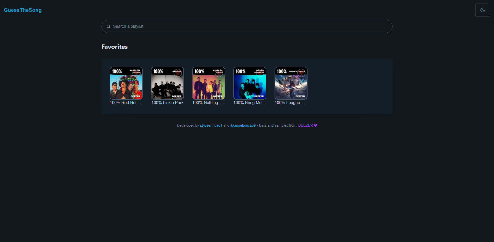

<h1 align="center"><a href="https://guessthesong-front.pages.dev/" target="_blank">Interface Here</a></h1>

<p align="center">
  
</p>

## ℹ️ About

This project is the frontend of the [GuessTheSong Application](https://github.com/josermca01/guess-the-song-flask).

All the data and samples used in the project comes from the [Deezer API](https://developers.deezer.com/).

It is all heavily inspired on [Musicle](https://musicle.app/), so be sure to go check it out!

This project is being hosted in [Cloudflare Pages](https://pages.cloudflare.com/) while its API is being hosted in [Verce](https://vercel.com/)

## ⌨️ Techs

Frontend was made using **Vite** as a build tool to create and manage a simple **React** application. Here are all the techs used:
- Vite
- React
  - react-router-dom
  - react-icons
  - react-spinners
- TypeScript
- Tailwind
- Pico CSS
- Axios

> [!NOTE]
>
>To run the project you would probably like to run your local [GuessTheSong API](https://github.com/josermca01/guess-the-song-flask).

## ⌨️ Running and Building

First Steps

To install and run the frontend dependencies you first need nodeJS installed and to be at root directory.

```
npm i
npm run
```

Note that to run successfuly, you'll need to create a `.env` file and add the `VITE_API_URL` key to it. You may use your local API address.
```
VITE_API_URL="http://localhost:5000"
```

## 🎶 That's all!
If you like it, consider to leave a ⭐! 
